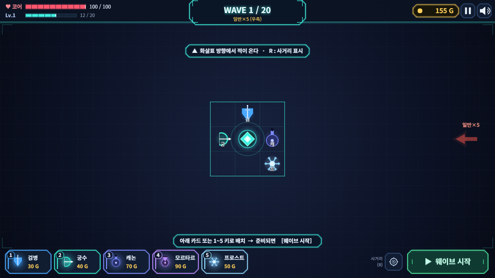

# Wave Defence

코어 중심 **그리드 방어** + 웨이브 간 **로그라이트 드래프트**를 결합한 2D 웨이브 디펜스 브라우저 게임.
설치 없이 URL로 바로 플레이하는 웹 배포를 목표로 합니다. **Phaser 4 · TypeScript · Vite.**



## 특징

- **공간이 희소자원인 배치 퍼즐** — 배치물 사거리를 그리드보다 짧게 유지해, *배치 위치가 곧 방어선*이 됩니다. 레벨업으로 그리드가 한 겹씩 확장(3×3 → 9×9)되는 것이 실질 보상.
- **배치물 이원화** — 유닛(검병·궁수)은 무료 재배치 + **막타 킬로 진급하는 베테랑 성장**, 구조물(캐논·모르타르·프로스트)은 골드로 사는 즉시 화력 + 골드 업그레이드.
- **완전 정보 공개** — 다음 웨이브의 스폰 방향·구성을 미리 보여주는 위치 퍼즐. 스폰 방향은 단방향 → 2방향 → 전방향으로 상승.
- **웨이브 간 3택1 드래프트** — 특성·시너지·트레이드오프·즉발 4분류 18장으로 매 판 다른 빌드.
- **코드 생성 네온 아레나 아트** — 외부 에셋 없이 스프라이트·이펙트를 코드로 생성. 발광 발사체·트레일·슬래시·폭발 등 이펙트와 사이버펑크풍 HUD.
- **편의 기능** — 전투 배속(×1/×2/×3), 사거리 상시 표시 토글, 일시정지 메뉴, 음소거(설정 저장), 첫 플레이 온보딩.

## 실행

요구: Node.js 20.19+ / 22.12+

```bash
npm install
npm run dev        # 개발 서버 (http://localhost:5173)
npm run build      # 타입체크 + 프로덕션 빌드 (dist/)
npm run preview    # 빌드 결과 미리보기
npm run typecheck  # tsc --noEmit
```

## 조작

| 조작 | 키 / 방식 |
|---|---|
| 배치물 선택 | 하단 카드 클릭 또는 숫자 **1~5** |
| 배치 확정 / 취소 | 그리드 클릭 / 우클릭·**ESC** |
| 유닛 재배치 | 드래그 (배치 페이즈) |
| 구조물 강화·철거 | 구조물 클릭 → 팝업 |
| 사거리 표시 | **R** 또는 하단 버튼 |
| 전투 배속 | **F** 또는 하단 버튼 (전투 중) |
| 일시정지 | **ESC** / **P** |

## 프로젝트 구조

```
src/
├── main.ts            # Phaser 설정 · 씬 등록
├── data/              # 밸런스 · 웨이브 · 카드 데이터 테이블
├── scenes/            # Boot · Title · Game(BUILD⇄WAVE) · UI(HUD) · Draft · Pause
├── entities/          # Enemy · Placeable · Projectile
└── systems/           # Grid · Sfx(WebAudio) · textures(스프라이트 생성) · ui(공통 컴포넌트)
```

밸런스 수치는 `src/data/`에만 두고 씬·엔티티에 하드코딩하지 않습니다.
상세 기획·수치 테이블·용어 사전은 **[docs/game-design.md](docs/game-design.md)** 참고.

## 라이선스

[MIT](LICENSE) — 코드·아트 모두 코드 생성물이라 서드파티 에셋 라이선스 제약이 없습니다.
